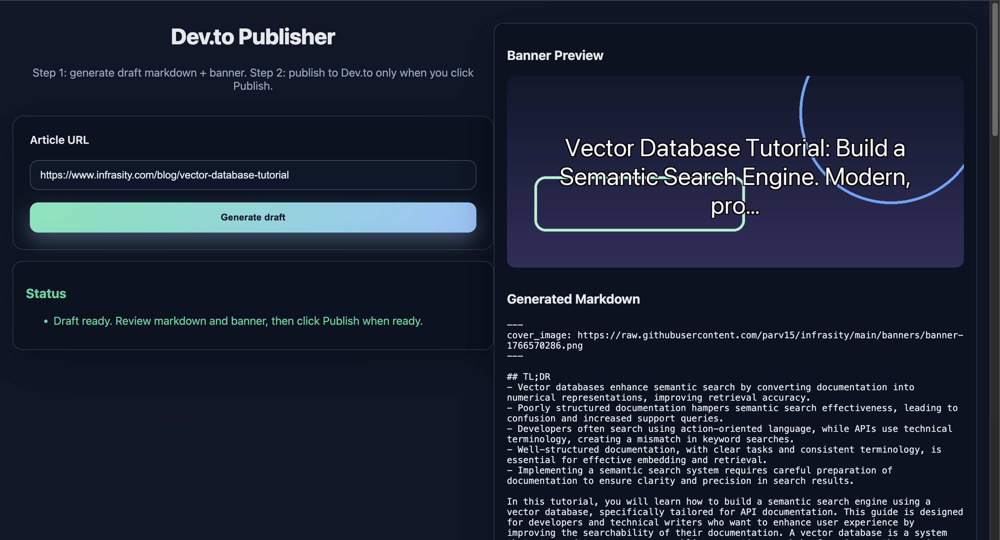

# Distribution to Dev.to

This repo shows a minimal Python script that:

- fetches a published blog URL
- summarizes it to ~800–1000 words with the OpenAI Agents SDK (structured for DEV.to guidelines)
- posts the summary to Dev.to

## Prerequisites

- Python 3.9+
- API keys:
  - `OPENAI_API_KEY`
  - `DEVTO_API_KEY`

## Setup

```bash
python -m venv .venv
source .venv/bin/activate
pip install -r requirements.txt
cp .env.example .env  # and fill in your keys
```

## Run

```bash
# copy env template and fill values first
cp .env.example .env

python app.py \
  --url "https://example.com/your-post" \
  --tags "ai,python" \
  --auto-banner \
  --publish
```

Flags:

- `--url` (required) The URL of the already published article.
- `--tags` Optional comma-separated tags for Dev.to.
- `--canonical` Optional canonical URL to send to Dev.to (defaults to the source URL).
- `--title` Optional override; otherwise the fetched page `<title>` is used.
- `--lock-title` Keep the provided title fixed for Dev.to (defaults on if `--title` is set; the markdown never contains an H1).
- `--banner` Optional image URL placed at the top of the markdown.
- `--auto-banner` Generate a banner image (provider controlled by `BANNER_PROVIDER`).
- `--banner-prompt` Custom prompt for banner generation; otherwise it is auto-built from title and leading content.
- `--banner-base-url` Base URL to serve generated banners (e.g., `http://localhost:5000/static/banners`). Optional if you use GitHub uploads (see below).

Optional env:
- `BANNER_PROVIDER` Banner provider: `local` (default), `openai`, `openrouter`, or `auto` (`auto` tries OpenAI, then OpenRouter, then falls back to local).
- `OPENAI_IMAGE_MODEL` Override the image model used for OpenAI image generation (default: `dall-e-3`).
- `BANNER_UPLOAD_PROVIDER` Where to host generated banners when `BANNER_BASE_URL` is not set. Supported: `github`.
- `GITHUB_TOKEN`, `GITHUB_REPO`, `GITHUB_BRANCH`, `GITHUB_PATH_PREFIX` Used when `BANNER_UPLOAD_PROVIDER=github`.
- `--publish` Actually publish; without it, the script only prints the payloads.

## Environment variables

Required:
- `OPENAI_API_KEY` — API key used by the summarizer and (optionally) OpenAI image generation.
- `DEVTO_API_KEY` — Dev.to API key used to publish articles.

Common optional environment variables (examples also present in `.env.example`):
- `BANNER_PROVIDER` — `local` (default), `openai`, `openrouter`, or `auto` (try `openai`, then `openrouter`, then `local`).
- `OPENAI_IMAGE_MODEL` — model identifier for OpenAI image requests (default: `dall-e-3`).
- `OPENAI_IMAGE_SIZE` — requested image size for OpenAI (e.g., `1024x1024`, `1792x1024`).
- `BANNER_OUTPUT_SIZE` — final center-cropped output size for banners (e.g., `1000x420`).
- `BANNER_DUMP_JSON` — optional path to save the OpenAI image response JSON for debugging.
- `BANNER_CAPTION` — optional caption text rendered onto generated banners (falls back to the company blurb).
- `BANNER_BASE_URL` — base URL where generated banners are served (e.g., `http://127.0.0.1:5000/static/banners`). If empty, the script may upload generated banners.
- `BANNER_UPLOAD_PROVIDER` — where to host generated banners when `BANNER_BASE_URL` is empty (supported: `github`).
- `GITHUB_TOKEN` — fine-grained token with Contents: Read and write (used when `BANNER_UPLOAD_PROVIDER=github`).
- `GITHUB_REPO` — repo in the form `owner/repo` to upload banners to (public repo recommended).
- `GITHUB_BRANCH` — branch to commit uploads to (default: `main`).
- `GITHUB_PATH_PREFIX` — folder prefix inside the repo to place uploaded banners (default: `banners`).
- `INLINE_BANNER` — `1`/`true` to embed an inline `` image in the markdown preview.
- `PRIMARY_KEYWORD` — optional SEO keyword the summarizer will try to include in the Introduction and one H2.
- `DEVTO_COMPANY_BLURB` — override the default company blurb appended to published posts.
- `CANONICAL_URL` — optional default canonical URL if not provided via CLI.

Tip: copy `Distribution to Dev.to/.env.example` to `.env` and fill the required keys before running the CLI or web UI.

Structure the model produces (aligned to checklist, ~800–1000 words total):

1. Optional banner image if provided (``)
2. Subtitle / intro hook (40–60 words)
3. Introduction (100–130 words, explicit definition)
4. Concept Explanation (H2, 150–200 words)
5. How It Works / Process (H2, 200–250 words, numbered steps)
6. Practical Example / Use Case (H2, 150–200 words)
7. Key Takeaways (H2, 3–5 bullets, 80–100 words)
8. FAQ (H2) with 2–4 questions as H3 headings and concise answers
9. Conclusion (H2, 60–80 words)
Note: The Dev.to title is provided separately and not rendered in the markdown body.


## Banner Providers

You can generate banners using:
- **local**: Fast, no external API, generates a simple PNG banner.
- **openai**: Uses OpenAI's DALL·E for high-quality banners (requires `OPENAI_API_KEY`).
- **openrouter**: Uses OpenRouter's Gemini/other models for banners (requires `OPENROUTER_API_KEY`).
- **auto**: Tries OpenAI, then OpenRouter, then falls back to local.

Set the provider with the `BANNER_PROVIDER` environment variable.

## Web UI (Flask)

You can also use a simple web interface to generate and preview Dev.to-ready summaries and banners.

**To run locally:**
```bash
cp .env.example .env  # fill in keys
python web.py  # defaults to http://127.0.0.1:5000
```

**Web UI Preview:**



**Notes:**
- For Dev.to publishing, the banner URL must be publicly reachable.
- Recommended: GitHub upload (no ngrok)
  1. Create a PUBLIC GitHub repo (or use an existing one).
  2. Create a fine-grained token with "Contents: Read and write" for that repo.
  3. Set in `.env`:
    - `BANNER_UPLOAD_PROVIDER=github`
    - `GITHUB_TOKEN=...`
    - `GITHUB_REPO=owner/repo`
- When `BANNER_BASE_URL` is empty, the script uploads the generated PNG to GitHub and uses the returned `download_url`.
- Local-only note: if you are just previewing the banner in the web UI (not publishing), you can still set `BANNER_BASE_URL` to `http://127.0.0.1:5000/static/banners`.

## How it works

1. Fetches the URL and extracts readable text + `<title>` using BeautifulSoup.
2. Calls the OpenAI Agents SDK (`agents.Agent` + `Runner.run_sync`) to produce an ~800–1000 word markdown summary.
3. Posts markdown to Dev.to using its public API.

## Notes

- The summarization prompt targets ~800–1000 words but the model may vary slightly.
- Dev.to publishing uses `published: true` when `--publish` is passed; otherwise it is a dry-run.
- Network errors are not retried in this simple example.

## Cover image behavior

When a banner URL exists, the script also injects DEV front matter `cover_image: <url>` so the banner becomes the Dev.to cover image (not just an inline image).
