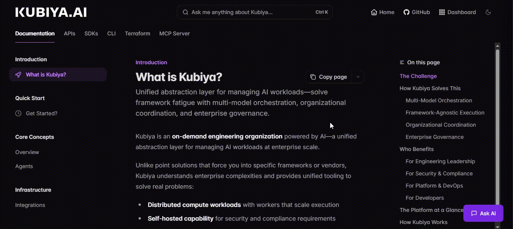
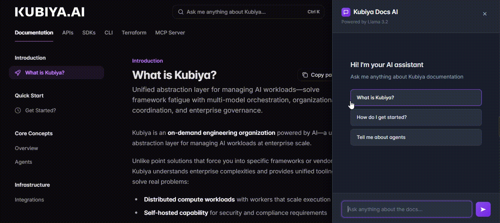

# AI-Powered Documentation Assistant (RAG-Based)


An AI documentation assistant built with Retrieval-Augmented Generation (RAG). It gives fast, accurate, source-backed answers from your docs using a fully local AI stack powered by Ollama.

For this implementation, we used Kubiya docs as the example documentation set and wired the assistant to answer strictly from that content (not from “general LLM knowledge”). That keeps results consistent, private, and easy to verify.

---

## Table of Contents

- [About The Project](#about-the-project)
- [Built With](#built-with)
- [Getting Started](#getting-started)
  - [Prerequisites](#prerequisites)
  - [Installation](#installation)
- [Product Walkthrough](#product-walkthrough)
  - [Ask AI Interface](#ask-ai-interface)
  - [AI Response and Source Attribution](#ai-response-and-source-attribution)
- [Architecture](#architecture)
- [Contributing](#contributing)
- [License](#license)

---

## About The Project

This project is an AI-powered documentation assistant embedded into a documentation site.  
Users can ask natural language questions and get answers grounded exclusively in the docs content.

We’re using Kubiya docs as the working example here, the same approach applies to any Mintlify-style docs repo.

Instead of relying on the model’s pre-trained knowledge, the assistant uses a Retrieval-Augmented Generation pipeline that:

- Indexes documentation files into a vector database
- Performs semantic search for relevant context
- Generates answers using a local LLM
- Returns citations to the original source files

The result is reliable documentation search with clickable sources and traceability.

Primary goals:

- Improve developer experience when navigating large documentation
- Reduce manual search and page hopping
- Provide instant, contextual answers
- Maintain full local deployment with zero external API dependency

---

## Project Structure

```
ai-documentation-assistant/
├── backend/                # Flask API, RAG pipeline, vector DB logic
├── core-concepts/          # MDX documentation content
├── introduction/           # Introduction docs
├── quickstart/             # Getting started docs
├── assets/
│   └── images/             # README screenshots and diagrams
├── .gitignore
├── chat-widget.js          # Frontend chat widget
├── docs.json               # Mintlify configuration
└── README.md               # Project documentation
```

---

## Built With

### Frontend

- Mintlify Documentation Platform
- Vanilla JavaScript
- HTML5 and CSS3
- Fetch API

### Backend

- Python 3.11
- Flask
- Flask-CORS
- LangChain
- LangChain Community Integrations

### AI and Data

- Ollama (Local LLM runtime)
- Llama 3.2 (Text generation model)
- all-MiniLM (Embedding model)
- ChromaDB (Vector database)

### Tooling

- Git
- npm
- pip
- Virtualenv

---

## Getting Started

Follow these instructions to run the project locally.

### Prerequisites

Ensure the following software is installed:

- Python 3.11 or higher
- Node.js 18 or higher
- npm
- Git
- Ollama (latest version)

System recommendations:

- Minimum 8 GB RAM
- At least 5 GB free disk space
- Windows, macOS, or Linux

---

### Installation

#### 1. Clone the Repository

```bash
git clone https://github.com/Infrasity-Labs/growth-marketing-playbooks.git
cd growth-marketing-playbooks/ai-documentation-assistant
```

#### 2. Install Ollama

Download and install Ollama from the [official website](https://ollama.ai).

Verify installation:

```bash
ollama --version
```

#### 3. Download Models

```bash
ollama pull llama3.2:1b
ollama pull all-minilm
ollama list
```

#### 4. Backend Setup

```bash
cd backend

python -m venv venv

# Activate virtual environment
# Windows
venv\Scripts\activate

# macOS / Linux
source venv/bin/activate

pip install flask flask-cors langchain langchain-community chromadb
```

#### 5. Frontend Setup

```bash
npm install -g mintlify
mintlify --version
```

#### 6. Start Services

Open three terminals.

**Terminal 1 – Ollama**

```bash
ollama serve
```

**Terminal 2 – Backend**

```bash
cd backend
python app.py
```

**Terminal 3 – Frontend**

```bash
mintlify dev
```

Access the documentation site:

```
http://localhost:3000
```
## Product Walkthrough

This section explains how the Ask AI feature works from a user perspective.

---

### Ask AI Interface



The Ask AI interface appears as a floating button inside the documentation website. When clicked, it opens a slide-in chat panel where users can interact with the documentation assistant.

**Key elements:**

- Clean chat interface aligned with the documentation theme
- Input box for natural language questions
- Quick suggestion buttons for first-time users
- Scrollable conversation history
- Send button and keyboard submission support

The interface also shows a few starter questions so users immediately know what kinds of queries work well.

**Example starter questions shown in the UI:**

- What is Kubiya?
- How do I get started?
- Tell me about agents

#### Additional Sample Questions for Testing

You can use the following queries to validate the system:

- What is Kubiya and what problem does it solve?
- How does Kubiya manage AI workloads?
- What are Kubiya agents?
- How do I get started with Kubiya?
- What are the core concepts in Kubiya?
- How does Kubiya handle orchestration?
- What integrations does Kubiya support?
- What is the purpose of the MCP server?
- How does Kubiya handle governance and access control?
- What APIs are available in Kubiya?

These questions demonstrate search accuracy, retrieval quality, and response grounding.

---

### AI Response and Source Attribution



When a user submits a question:

1. The query is sent to the backend API
2. The query is embedded into a vector representation
3. The vector database performs semantic similarity search
4. Relevant documentation chunks are retrieved
5. The language model generates an answer using only retrieved context
6. Source references are attached to the response

**The response UI displays:**

- A concise and relevant answer
- A list of source files used to generate the answer
- Snippets from each source for verification

**This approach ensures:**

- Answers remain factual and grounded
- Users can validate information instantly
- Reduced hallucinations (answers are constrained to retrieved context)
- Higher trust in documentation accuracy

---

## Architecture


The system follows a three-layer architecture:

### Client Layer

- Mintlify documentation site
- Embedded chat widget
- User interaction handling

### Application Layer

- Flask backend API
- LangChain RAG pipeline
- Query processing and orchestration

### Data and AI Layer

- ChromaDB vector store
- Ollama local inference engine
- Embedding and generation models

### High-level Flow

1. User submits question from UI
2. Backend generates query embedding
3. Vector database retrieves relevant context
4. LLM generates grounded answer
5. Sources are attached and returned
6. UI renders answer and citations

This design enables local deployment, predictable latency, and full data ownership.

---

## Contributing

Contributions are welcome.

### How to Contribute

1. Fork the repository
2. Create a new feature branch

```bash
git checkout -b feature/your-feature-name
```

3. Commit your changes

```bash
git commit -m "Add meaningful description"
```

4. Push to your fork
5. Open a pull request

### Contribution Guidelines

- Follow PEP8 for Python code
- Keep commits small and focused
- Update documentation when behavior changes
- Avoid breaking existing flows
- Test locally before submitting

---

## License

This project is maintained by **Infrasity Labs**. All rights reserved unless otherwise specified.

---


## Version

- **Version:** 1.0.0
- **Last Updated:** January 2026
