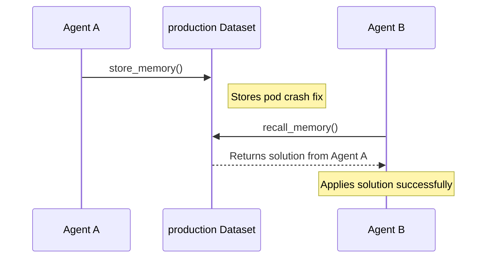
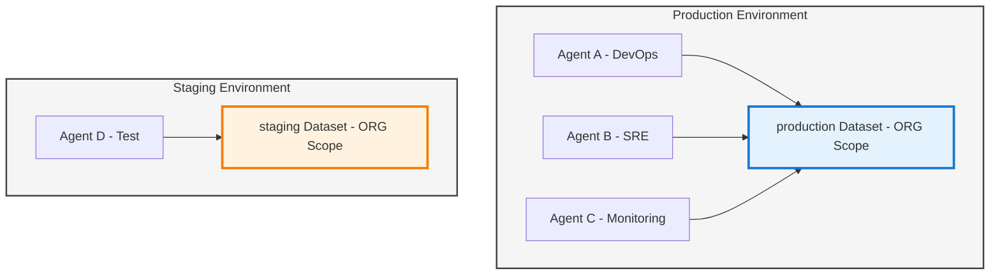

Agents are configurable AI services that plan and execute tasks. Each agent runs a selected LLM model, a set of Skills (and optional MCP servers), and the configuration it inherits from attached Environments. Agents execute deterministic step-by-step plans, using Skills for system operations and MCP integrations for external APIs.


Examples:

* A **DevOps Assistant** that checks system health and deploys updates
* A **Cost Auditor** that reviews cloud spending and raises alerts
* A **SRE Helper** that diagnoses incidents using logs, metrics, and runbooks

Agents are reusable, can be shared across teams and workflows, and automatically inherit configuration from the Environments they run in.

## **When to use an Agent**

Create an agent when you need a reusable operational capability that:

* Runs tasks repeatedly (deployments, audits, checks)
* Automates domain workflows (SRE, DevOps, ops, finance, support)
* Can be invoked by users, Teams, or tasks and workflows

## **Prerequisites**

Before creating an agent, ensure:

* At least one **Environment** is in **Ready** state
* A **Task Queue** with at least one connected worker is attached to that Environment
* Any required **secrets** or **integration credentials** exist (prefer storing them at the Environment level)

## **Built-in Cognitive Capabilities**

**Every agent automatically inherits cognitive memory capabilities.** No configuration required.

All agents can store context, recall relevant information, and share knowledge across your organization through Kubiya's Cognitive Memory system.

### **Automatic Skills**

Agents inherit these cognitive memory operations by default:

* **`store_memory(content, metadata)`** - Store context, findings, solutions
* **`recall_memory(query, limit)`** - Semantic search across stored memories
* **`list_memories()`** - List all stored memories for current context
* **`get_dataset_info()`** - Get information about current dataset

These skills are always available—agents can use them without any setup.

### **Environment-Based Datasets**

**By default, agents automatically use a dataset named after their execution environment.**

| Agent Environment | Default Dataset | Scope | Shared With |
|-------------------|----------------|-------|-------------|
| `production` | `production` | ORG | All agents in production |
| `staging` | `staging` | ORG | All agents in staging |
| `dev` | `dev` | ORG | All agents in dev |

**Benefits:**
* **Automatic isolation** - Production agents can't access staging memories
* **Shared team context** - All agents in the same environment share knowledge
* **Zero configuration** - Works out of the box, no setup needed
* **Environment-specific learning** - Each environment builds its own knowledge base

### **Cross-Agent Memory Sharing**

Agents in the same environment share an organization-scoped dataset, enabling collective learning:



**Key benefits:**
* Agents don't re-solve problems already handled
* Organizational knowledge compounds over time
* Audit trail shows which agent solved what
* Teams learn collectively

### **Environment Context**

Agents automatically know their execution environment through:

* **Environment variable**: `KUBIYA_ENVIRONMENT`
* **Automatic dataset selection**: Uses environment name as dataset name
* **Isolation**: Production memories ≠ staging memories

**Environment-based dataset isolation:**



<Info>
Learn more about cognitive memory capabilities in [Cognitive Memory Overview](/core-concepts/cognitive-memory/overview).
</Info>

## **Key concepts & defaults**

* **Model**
  The LLM the agent uses (Sonnet, Opus, GPT-4o). Higher tiers are more capable but costlier.
* **Skills**
  Capabilities for local/system operations (shell, file operations, Docker, Python). Agents inherit Skills from their Environments.
* **MCP Servers**
  External services and platform APIs the agent can call.
* **Environments**
  Provide runtime configuration, env vars, secrets, credentials, and policies.
* **Policies (OPA)**
  Attach after creation to restrict actions or access.
* **System Prompt**
  Defines AI instructions. The default covers tool usage, planning, and safety. Edit only when needed.

## **Create an agent**


### **1\. Basic Info**

* **Agent Name**
   Clear and specific: “DevOps Assistant”, “SRE Helper”, “Cost Auditor”.
* **Description**
   Helps users understand the use case.
* **AI Model**
   Select capability tier appropriate for the tasks.
* **Capabilities (tags)**
   Optional filters such as: `devops`, `monitoring`, `cost`, `security`.

### **2\. Deployment**

* **Runtime**
   Choose the execution engine for your agent. [Agno](/core-concepts/runtimes/agno-runtime) for multi-model flexibility, [Claude Code](/core-concepts/runtimes/claude-code-runtime) for code-focused tasks. [Compare runtimes](/core-concepts/runtimes/comparison) to decide.
* **Environments**
   Add one or more Environments (e.g., `staging`, `prod`).
   The agent inherits configuration and can run where capacity exists.

Tip: If the agent should operate in multiple environments, attach both and keep environment-specific secrets and URLs at the Environment level, not the agent.

### **3\. Execution Environment**

* **Environment Variables**
   Non-secret configuration values.
* **Secrets**
   Add only when agent-specific. Prefer keeping shared secrets on the Environment.
* **Integration Credentials**
   Add credentials for external systems the agent needs to access.

### **4\. Tools (Skills & MCP)**

#### **MCP Servers**

* Leave **Enable Kubiya Platform APIs** ON unless restricted by policy.
* Add custom MCP servers as needed (name, command, arguments).

#### **Skills**

* Add only the minimum Skills required.
* Remember: Skills from Environments also apply.

### **5\. Policies**

After saving the agent, return to associate OPA policies that limit scope (e.g., allowed paths, allowed commands, allowed resources).

### **6\. Advanced**

* **System Prompt**
   A sensible default is provided. Adjust only to add specific constraints or operational guidance.
   Keep it short, testable, and easy to maintain.

### **Verify & troubleshoot**

After creation, open the agent’s Chat and run a safe read-only test such as:

```bash
List running services.
```

If a task remains **Pending**:

* Ensure the target Environment is **Ready**
* Check the Environment's Task Queue has at least one connected worker
* Verify required Skills or credentials are attached
* Review OPA policies for restrictions blocking execution

<Note>For more info on how to use the cli to manage agents go to [Agents Cli](./../cli/resources#agents)</Note>

## **Best Practices**

* Start with **least privilege**, add Skills gradually
* Store common secrets/config at the **Environment** level
* Use one agent across multiple Environments instead of cloning
* Test with simple read-only commands first
* Apply OPA policies after verifying correct behavior

## **Next Steps**

* Attach more Skills or MCP integrations
* Ensure Task Queues have active workers
* Build tasks or workflows that use this agent
* Configure policies for safe multi-environment operation
